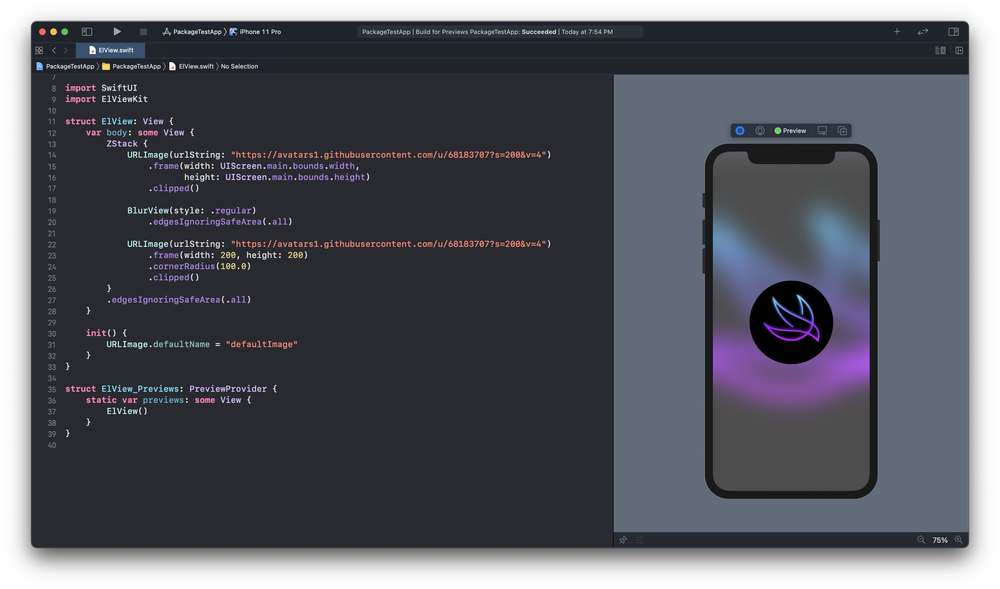

# ElViewKit

This is a Swift package providing some view for SwiftUI.

- Copyright: ©Jaesung

## Swift @ home 🏠

## Requirements

- Xcode 12+
- iOS13+ (Some features may require iOS14)

## Features
### View
#### BlurView
```swift
BlurView(style: .regular)
```
The view that has blur effect. This view allows you to blur a specific area
#### URLImage
```swift
URLImage("https://someurl")
```
The view that shows image based on URL. 
> **IMPORTANT** You have to set `URLImage.defaultName` before loading URL image. I recommend that you set the value inside of initializer.

### Modifier
#### Image resizer
```swift
Image("backgroundImage")
    .resizedToFill(width: 100, height: 50)
```
- resizedToFit: Resize image and adjust aspect ratio as `.fit`. You don't need to call `resizable()`
- resizedToFill: Resize image and adjust aspect ratio as `.fill`. You don't need to call `resizable()`
> **NOTE** When you set width value only, the image shows square image.

## How to use

Xcode > File > Swift Packages > Add Package Dependency > Enter repository URL: https://github.com/jaesung-wwdc/ElViewKit

```Swift
import ElViewKit
import SwiftUI

struct SomeView: View {
    var body: some View {
        ZStack {
            // Image Modifier
            Image("backgroundImage")
                .resizedToFill(width: UIScreen.main.bounds.width,
                               height: UIScreen.main.bounds.height)
                .edgesIgnoringSafeArea(.all)
                
            // Blur View
            BlurView(style: .regular).edgesIgnoringSafeArea(.all)
        
            // URL Image
            URLImage("https://avatars1.githubusercontent.com/u/68183707?s=200&v=4")
                .frame(width: 100, height: 100)
                .clipped()
        }            
    }
    
    init() {
        // URL Image
        URLImage.defaultName = "defaultImage"
    }
}

```
