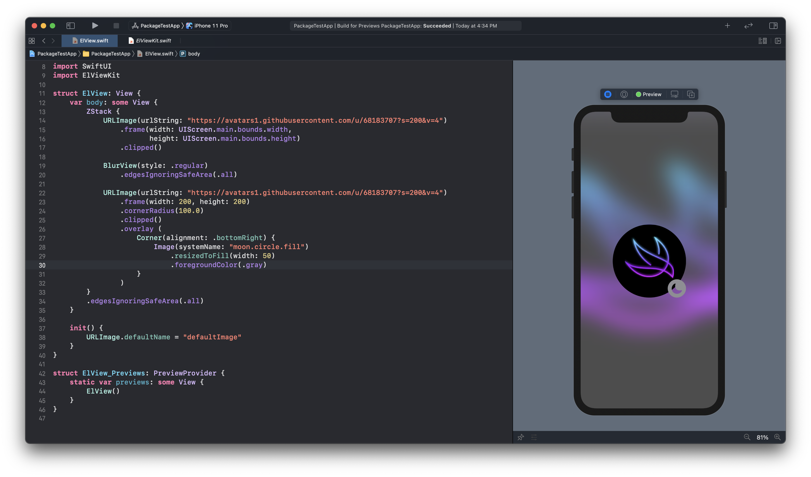

# ElViewKit

This is a Swift package providing some view for SwiftUI.

- Copyright: ©Jaesung

## Swift @ home 🏠

## Requirements

- Xcode 12+
- iOS13+ (Some features may require iOS14)

## How to use

Xcode > File > Swift Packages > Add Package Dependency > Enter repository URL: https://github.com/jaesung-wwdc/ElViewKit

```Swift
import ElViewKit
import SwiftUI

struct SomeView: View {
    var body: some View {
        ZStack {
            // Image Modifier
            Image("backgroundImage")
                .resizedToFill(width: UIScreen.main.bounds.width,
                               height: UIScreen.main.bounds.height)
                .edgesIgnoringSafeArea(.all)
                
            // Blur View
            BlurView(style: .regular).edgesIgnoringSafeArea(.all)
        
            // URL Image
            URLImage("https://avatars1.githubusercontent.com/u/68183707?s=200&v=4")
                .frame(width: 100, height: 100)
                .clipped()
        }            
    }
    
    init() {
        // URL Image
        URLImage.defaultName = "defaultImage"
    }
}

```
